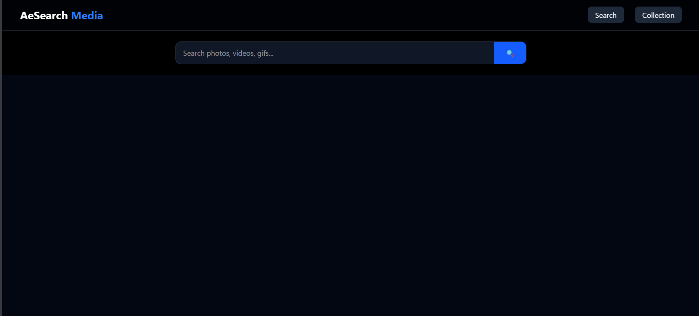
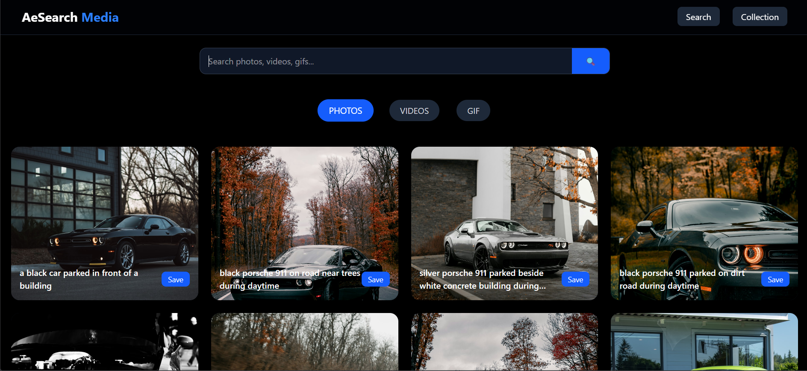
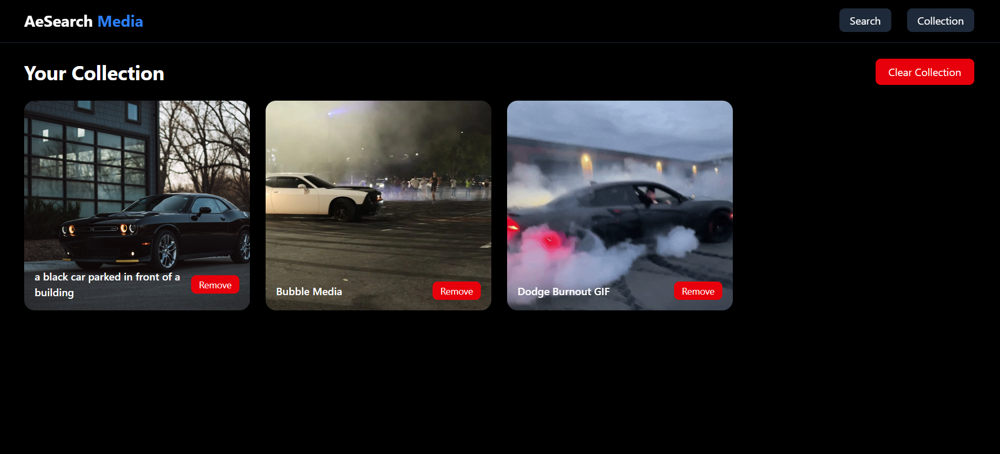

# 🚀 AeSearch Media App

AeSearch is a modern and fast media search application built with React. It allows users to explore **Photos, Videos, and GIFs** from multiple APIs and save their favorite content in a personal collection.

---

## 🔗 Live Demo
https://aesearch-media.vercel.app

---

## ✨ Features

- 🔍 Search Photos, Videos & GIFs  
- ⚡ Fast & Optimized Performance  
- 📱 Fully Responsive Design  
- 🎬 Video Preview on Hover  
- 🖼 Progressive Image Loading  
- ❤️ Save to Collection (Redux + localStorage)  

---

## 🛠 Tech Stack

- ⚛️ React (Vite)  
- 🧠 Redux Toolkit  
- 🎨 Tailwind CSS  
- 🌐 Unsplash API  
- 🎥 Pexels API  
- 😂 Giphy API  

---

## 📸 Screenshots

### 🏠 Home


### 🔍 Results


### ❤️ Collection


---

## 📦 Installation

```bash
git clone https://github.com/your-username/aesearch-media.git
cd aesearch-media
npm install
npm run dev
